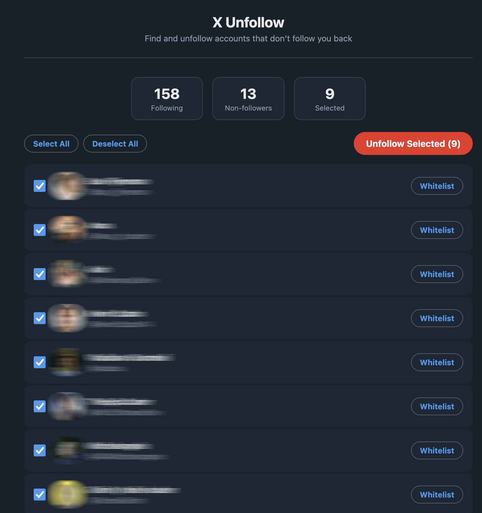
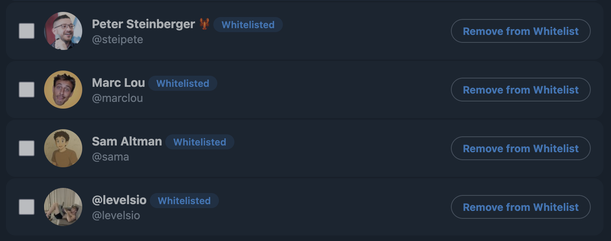

# X Unfollow

A Firefox extension that finds accounts you follow on X (Twitter) that don't follow you back, and lets you unfollow them in bulk.

## Features

- Scans your entire following list and identifies non-followers
- Review list before unfollowing — deselect anyone you want to keep
- Whitelist accounts to permanently protect them from being unfollowed

- Configurable unfollow speed (slow/medium/fast)
- Per-session unfollow cap to limit how many you remove at once
- Paginated results for large lists
- Rate limit handling with automatic backoff
- Dark theme UI matching X's design

## Install

1. Download the latest `x-unfollow-v*.zip` from [Releases](https://github.com/prodigeris/x-unfollow/releases/latest)
2. Unzip it
3. Open Firefox and go to `about:debugging#/runtime/this-firefox`
4. Click **Load Temporary Add-on**
5. Select `manifest.json` from the unzipped folder

> **Note:** Temporary add-ons are removed when Firefox restarts. You'll need to re-load it each session.

## Usage

1. Make sure you're logged into [x.com](https://x.com)
2. Browse any page on x.com (the extension needs to capture API tokens from your session)
3. Click the X Unfollow extension icon in the toolbar
4. Click **Scan Following List**
5. Review the non-followers list, deselect anyone you want to keep
6. Adjust speed and session cap in settings if needed
7. Click **Unfollow Selected**

## How It Works

The extension uses X's internal GraphQL API (the same one the website uses) to fetch your following list. It reads the `relationship_perspectives.followed_by` field to determine who follows you back. Unfollows use the REST `friendships/destroy` endpoint.

No external servers are involved. Everything runs locally in your browser.

## Settings

| Setting | Default | Description |
|---------|---------|-------------|
| Unfollow speed | Slow (5-12s) | Delay between unfollows. Slow is safest. Fast risks rate limits. |
| Session cap | 200 | Max unfollows per session. Prevents accidentally removing too many. |

## Disclaimer

This extension interacts with X's internal APIs, which are undocumented and may change at any time. Use at your own risk. Mass unfollowing may trigger rate limits or account restrictions from X.

## License

MIT

## Author

Built by [@Prodigers](https://x.com/Prodigers)
