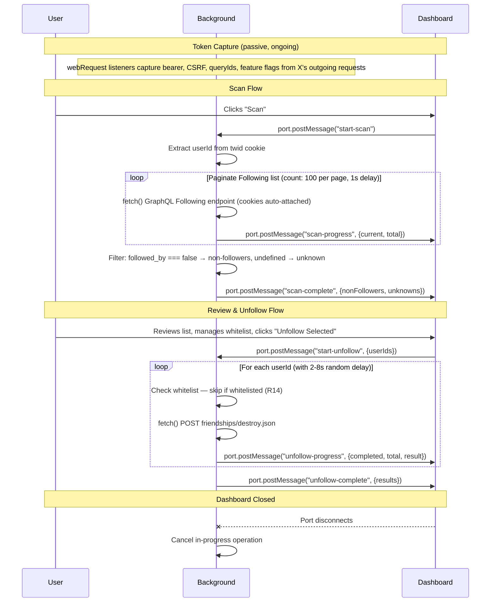

# feat: X Unfollow Firefox Extension

## Overview

Build a Firefox extension that identifies X (Twitter) accounts that don't follow you back and lets you selectively unfollow them. The extension intercepts X's internal GraphQL API to collect data and uses the REST API to perform unfollows, all through the user's existing authenticated session.

## Problem Frame

X doesn't provide a way to see non-followers or bulk-unfollow. Manual checking is tedious for accounts following hundreds or thousands of people. This extension automates the discovery and provides a controlled, review-first unfollow flow. (see origin: `docs/brainstorms/2026-04-14-x-unfollow-firefox-extension-requirements.md`)

## Requirements Trace

- R1. Collect following list from X's web UI
- R2. Produce a non-followers list
- R3. Progress indicator during scanning
- R4. Cancel scan mid-run
- R5. Warn on incomplete/failed scans
- R6. Dedicated browser tab for review UI
- R7. Show avatar, display name, handle, checkbox per entry
- R8. Deselect individual accounts
- R9. Select All / Deselect All toggle
- R10. Summary stats
- R11. Persistent whitelist in extension storage
- R12. Whitelisted accounts unchecked by default, visually marked
- R13. Whitelist persists across sessions
- R14. Unfollow skips whitelisted accounts regardless of checkbox state
- R15. "Unfollow Selected" button
- R16. Randomized 2-8s delays between unfollows
- R17. Configurable per-session unfollow cap (~200 default)
- R18. Per-action unfollow progress
- R19. Cancel unfollow mid-run
- R20. Results report (successes, failures, skipped)
- R21. Firefox Manifest V2
- R22. Toolbar icon opens dashboard tab
- R23. No external API calls

## Scope Boundaries

- No official X API key — uses authenticated session only
- No data export (CSV, etc.)
- No scheduled/automatic scans
- Firefox only
- Personal use + GitHub distribution

## Context & Research

### Key Technical Findings

**Major simplification discovered**: The `followed_by` field on each user entry in X's `Following` GraphQL response tells you directly whether that person follows you back. This means we only need to paginate the Following list — no need to separately fetch the full Followers list. This halves API calls and scan time.

**X's internal API structure**:
- Following list: `GET /i/api/graphql/{queryId}/Following` with `userId`, `count`, `cursor` variables
- Unfollow: `POST /i/api/1.1/friendships/destroy.json` with `user_id` body param (REST, more stable than GraphQL)
- Auth requires: public bearer token (hardcoded in X's JS, stable for years), `ct0` cookie as CSRF token, session cookies
- GraphQL queryIds change on X frontend deploys — must be captured dynamically
- Feature flags JSON object required in query params — must be captured from live requests
- Response path: `data.user.result.timeline.timeline.instructions[].entries[]` — but this path is approximate and has known variants (`timeline_v2.timeline.instructions`, `__typename` wrappers). The implementer must verify against a live response and handle multiple shapes defensively.

**Firefox MV2 architecture**:
- `webRequest.onSendHeaders` captures bearer token, CSRF token, queryIds, and feature flags from outgoing request headers/URLs
- Background script makes API calls with `fetch()` + `credentials: "include"` (cookies sent automatically with host permission)
- Port-based connections (`runtime.connect`) for real-time progress streaming to dashboard tab
- `browser.storage.local` for persistent whitelist data and settings
- CSP directive needed: `img-src 'self' https://pbs.twimg.com https://abs.twimg.com`

**Rate limits (observed)**:
- ~500 read requests per 15-min window (pagination)
- ~400 unfollows per day soft limit; rapid-fire triggers lock after ~50-100
- 2-8s random delay + ~200 session cap aligns with community-tested safe thresholds
- HTTP 429 or error code 88 signals rate limiting

### Institutional Learnings

- No prior solutions exist in this repo (greenfield)

## Key Technical Decisions

- **API interception over DOM scraping**: X uses virtualized infinite-scroll lists (~15-20 DOM nodes at a time) with obfuscated CSS classes. API interception gives structured JSON, is faster, and far more reliable. (see origin: Outstanding Questions)
- **Following-only scan via `followed_by` field**: Each entry in the Following response includes `followed_by: boolean`. Checking this field identifies non-followers without fetching the full Followers list separately. This halves scan time and API calls. Entries where `followed_by` is undefined/null (e.g., suspended accounts) are treated as "unknown" and surfaced separately in the UI.
- **REST endpoint for unfollows**: `POST /i/api/1.1/friendships/destroy.json` is simpler and more stable than any GraphQL mutation. X's own frontend uses it.
- **Dynamic queryId/feature-flag capture via webRequest**: QueryIds extracted from `webRequest.onBeforeRequest` URL patterns. Feature flags extracted from the `features` query parameter on intercepted GraphQL requests. Both captured passively from the background script — no content script needed.
- **No content script**: All token, queryId, and feature flag capture happens via `webRequest` listeners in the background script. The background script also makes all API calls directly. No content script is injected into X pages, reducing complexity and avoiding page-world injection risks.
- **Background script as API caller**: The background script holds auth tokens and makes all API calls directly (with `credentials: "include"` for cookies).
- **Port-based progress streaming**: `runtime.connect` port between dashboard tab and background script for real-time scan/unfollow progress. `browser.storage.local` for persistent data (whitelist, settings).
- **Manifest V2**: Simpler, fully supported, persistent background scripts (no service worker complexity).
- **CSRF token source**: Primary source is `webRequest.onSendHeaders` (captures `x-csrf-token` header from outgoing requests). Fallback: read `ct0` cookie directly via `browser.cookies.get()` if header capture hasn't fired yet.
- **Closing dashboard cancels operations**: If the dashboard tab is closed (port disconnects), the background script cancels any in-progress scan or unfollow operation. This ensures the user retains control and unfollows never continue silently.

## Open Questions

### Resolved During Planning

- **Scraping architecture**: API interception — background script makes direct GraphQL calls using captured tokens and queryIds. No DOM scraping needed.
- **Unfollow mechanism**: REST `POST /i/api/1.1/friendships/destroy.json` — simpler and more stable than GraphQL.
- **Do we need to fetch the Followers list?**: No — the `followed_by` field on each Following entry is sufficient. "Total followers" stat in the dashboard comes from the user's profile metadata (available in the authenticated session), not from paginating the Followers list.
- **Communication pattern**: Port-based connection for progress streaming; `browser.storage.local` for persistent whitelist and settings. Background script brokers all API calls.
- **Avatar CSP**: Add `img-src 'self' https://pbs.twimg.com https://abs.twimg.com` to manifest CSP.
- **How to get queryIds**: Capture dynamically from `webRequest.onBeforeRequest` when X makes its own GraphQL calls.
- **How to get auth tokens**: `webRequest.onSendHeaders` captures bearer and CSRF from outgoing request headers. Fallback for CSRF: read `ct0` cookie directly.
- **How to get the user's numeric ID**: Extract from `twid` cookie (`u%3D{userId}`).
- **Do we need a content script?**: No. All capture and API calls are handled by the background script via `webRequest` and `fetch()`.
- **What if `followed_by` is undefined?**: Treat as "unknown follow status" — surface these accounts in a separate section in the UI so the user can decide manually.
- **Feature flags bootstrap**: The extension requires the user to browse X normally before scanning. The first GraphQL request X makes (to any endpoint) provides the feature flags via the `features` query parameter. The dashboard shows clear guidance: "Browse x.com and visit any profile's Following page to initialize the extension." If a scan is attempted without captured feature flags, show an error with specific instructions.
- **TimelineClearCache instructions**: Handle defensively — skip any instruction that is not `TimelineAddEntries` rather than treating it as an error. This covers `TimelineClearCache` and any other unknown instruction types.
- **Port disconnection behavior**: Background script cancels in-progress operations when the dashboard port disconnects. No silent continuation.

### Deferred to Implementation

- Exact feature flags JSON object — must be captured from a live intercepted request and may change over time
- Tuning the delay range and session cap based on real-world testing
- Whether X's response path uses `timeline` or `timeline_v2` — implementer must verify against live response

## Output Structure

```
src/
├── manifest.json
├── background.js          # Token capture, API calls, state machine, message router
├── dashboard.html         # Full-page tab UI shell
├── dashboard.js           # Dashboard logic — renders list, handles user actions
├── dashboard.css          # Dashboard styles
├── lib/
│   ├── api.js             # X API call helpers (following list, unfollow)
│   ├── scanner.js         # Scan orchestration (pagination, progress, cancellation)
│   ├── unfollower.js      # Unfollow orchestration (delays, cap, progress, cancellation)
│   └── storage.js         # Whitelist and settings persistence
└── icons/
    ├── icon-48.png
    └── icon-96.png
```

## High-Level Technical Design

> *This illustrates the intended approach and is directional guidance for review, not implementation specification. The implementing agent should treat it as context, not code to reproduce.*



## Implementation Units

- [x] **Unit 1: Extension scaffold and manifest**

  **Goal:** Set up the extension directory structure, manifest.json, and placeholder files so the extension can be loaded in Firefox.

  **Requirements:** R21, R22

  **Dependencies:** None

  **Files:**
  - Create: `src/manifest.json`
  - Create: `src/background.js` (minimal — log "loaded", open dashboard on icon click)
  - Create: `src/dashboard.html` (minimal shell)
  - Create: `src/dashboard.js` (minimal)
  - Create: `src/dashboard.css` (minimal)
  - Create: `src/icons/icon-48.png`, `src/icons/icon-96.png`

  **Approach:**
  - Manifest V2 with permissions: `webRequest`, `storage`, `tabs`, `cookies`, `*://*.x.com/*`, `*://*.twitter.com/*`
  - Note: `webRequestBlocking` is not needed — all listeners are read-only
  - CSP: `script-src 'self'; object-src 'self'; img-src 'self' https://pbs.twimg.com https://abs.twimg.com;`
  - `browser_action` with `default_icon` and `default_title`
  - Background script `persistent: true`
  - No content scripts in manifest — all work done by background script
  - For icons, generate simple placeholder PNGs or use a minimal icon

  **Patterns to follow:**
  - Standard Firefox MV2 extension structure

  **Test scenarios:**
  - Happy path: Extension loads in Firefox without errors (check `about:debugging` → "This Firefox" → extension appears with no error badge)
  - Happy path: Clicking the toolbar icon opens `dashboard.html` in a new tab
  - Edge case: Extension loads correctly on both `x.com` and `twitter.com` domains (host permissions)

  **Verification:**
  - Extension loads in `about:debugging` without errors
  - Toolbar icon visible and clickable
  - Dashboard tab opens on click

- [x] **Unit 2: Token, queryId, and feature flag capture**

  **Goal:** Background script passively captures authentication tokens, GraphQL operation hashes, and feature flags from X's outgoing requests.

  **Requirements:** R23 (uses session data, no external API)

  **Dependencies:** Unit 1

  **Files:**
  - Modify: `src/background.js`

  **Approach:**
  - `webRequest.onSendHeaders` listener on `*://x.com/i/api/*` and `*://twitter.com/i/api/*` — extract `authorization` and `x-csrf-token` headers
  - `webRequest.onBeforeRequest` listener on `*://x.com/i/api/graphql/*` — regex-match URL path to extract queryId for `Following` operation; also parse the `features` query parameter from the URL for later replay
  - Note: only capture the `Following` queryId — Followers endpoint is not used; unfollow uses a REST endpoint with no queryId
  - Extract user's numeric ID from `twid` cookie via `browser.cookies.get()`
  - Store all captured values in background script state object
  - CSRF fallback: if `x-csrf-token` header not yet captured, read `ct0` cookie directly via `browser.cookies.get()`

  **Patterns to follow:**
  - Firefox `webRequest` API patterns
  - State held in module-level object in background script (persistent in MV2)

  **Test scenarios:**
  - Happy path: After navigating to x.com and browsing normally, bearer token and CSRF token are captured
  - Happy path: After visiting a Following page, queryId and feature flags are captured
  - Happy path: User's numeric ID is correctly extracted from `twid` cookie
  - Edge case: CSRF token rotates (ct0 cookie changes) — new value is captured on next request
  - Error path: User is not logged in — no auth headers present, state remains empty
  - Edge case: Feature flags not yet captured (user hasn't visited Following page) — state correctly reports readiness as incomplete

  **Verification:**
  - Log captured tokens, queryId, and feature flags to console — verify they are populated after browsing X
  - Verify userId extraction matches the logged-in account
  - Verify readiness check reports complete only when all required values are present

- [x] **Unit 3: Following list scanner with pagination**

  **Goal:** Background script paginates X's Following GraphQL endpoint, collects all entries, and identifies non-followers using the `followed_by` field.

  **Requirements:** R1, R2, R3, R4, R5

  **Dependencies:** Unit 2

  **Files:**
  - Create: `src/lib/api.js`
  - Create: `src/lib/scanner.js`
  - Modify: `src/background.js` (wire up scan message handlers)

  **Approach:**
  - `api.js`: Helper that builds the GraphQL request URL with variables and features, makes `fetch()` with `credentials: "include"` and captured auth headers, returns parsed JSON
  - `scanner.js`: Orchestrates pagination loop:
    1. Call Following endpoint with `count: 100`, no cursor (100 entries per page to minimize scan time)
    2. Parse response: extract user entries from instructions array — try known paths defensively (`timeline.instructions`, `timeline_v2.timeline.instructions`), skip non-`TimelineAddEntries` instruction types
    3. For each user entry, extract `rest_id`, `screen_name`, `name`, `profile_image_url_https`, `followed_by`
    4. Classify: `followed_by === false` → non-follower; `followed_by === undefined/null` → unknown status
    5. Extract bottom cursor from cursor entries for next page
    6. Report progress via callback after each page
    7. Check cancellation flag between pages
    8. Loop until no more cursor or cancelled
    9. If dashboard port disconnects, cancel scan
  - 1-second delay between pagination requests to stay well within rate limits
  - Detect incomplete scan: if API errors occur mid-pagination or scan is cancelled, flag as partial and preserve collected data (R5)

  **Test scenarios:**
  - Happy path: Scans a following list and correctly identifies non-followers via `followed_by === false`
  - Happy path: Pagination completes when bottom cursor is absent (end of list)
  - Happy path: Progress callback fires after each page with running counts
  - Edge case: User follows 0 accounts — returns empty non-followers list immediately
  - Edge case: All following accounts follow back — non-followers list is empty
  - Edge case: `followed_by` is undefined on some entries — classified as "unknown" and reported separately
  - Edge case: Response contains non-`TimelineAddEntries` instruction (e.g., `TimelineClearCache`) — skipped gracefully
  - Edge case: Suspended/deactivated accounts appear with limited data — collected without error
  - Error path: API returns 429 rate limit — backs off with exponential delay, retries
  - Error path: API returns 403 (stale CSRF) — re-reads ct0 cookie and retries once
  - Error path: Network error mid-pagination — scan marked as partial, collected data preserved, user warned
  - Happy path: User cancels mid-scan — pagination stops, partial results returned with warning
  - Happy path: Dashboard port disconnects mid-scan — scan cancelled, results discarded

  **Verification:**
  - Scanner returns a complete non-followers list matching manual spot-checks
  - Progress updates stream correctly
  - Cancellation stops pagination within one page cycle
  - Unknown-status accounts are separated from confirmed non-followers

- [x] **Unit 4: Dashboard UI — scan and review**

  **Goal:** Full-page tab that lets the user trigger a scan and review the non-followers list with checkboxes, stats, and select/deselect controls.

  **Requirements:** R6, R7, R8, R9, R10

  **Dependencies:** Unit 3

  **Files:**
  - Modify: `src/dashboard.html`
  - Modify: `src/dashboard.js`
  - Modify: `src/dashboard.css`

  **Approach:**
  - Dashboard connects to background via `browser.runtime.connect({ name: "dashboard" })` port
  - Background script tracks active dashboard ports — only one active at a time. If a second dashboard tab connects, show a warning in the second tab.
  - States: idle → scanning → review → unfollowing → results
  - **Idle state**: "Scan" button. If tokens/queryId/feature flags not yet captured, show specific guidance: "Browse x.com and visit any profile's Following page to initialize the extension." with a link to open x.com.
  - **Scanning state**: Progress bar showing entries collected / estimated total (from following count on profile). Cancel button.
  - **Review state**:
    - Summary stats bar: total following (from scan), non-followers count, selected-for-unfollow count
    - "Unknown status" section if any entries had undefined `followed_by` — shown separately with explanation
    - Scrollable list of non-follower cards: avatar image, display name, @handle, checkbox (checked by default)
    - Select All / Deselect All toggle
    - "Unfollow Selected" button with count badge
  - Avatar images load from `pbs.twimg.com` (allowed by CSP); use placeholder on load failure
  - Clean, functional design — no framework, vanilla HTML/CSS/JS

  **Patterns to follow:**
  - Standard extension dashboard page pattern — no build tools, vanilla JS

  **Test scenarios:**
  - Happy path: Click "Scan", see progress bar update, then see the non-followers list rendered with avatars, names, handles
  - Happy path: Checkboxes are checked by default; unchecking removes from selected count
  - Happy path: Select All checks all, Deselect All unchecks all — selected count updates
  - Happy path: Summary stats show correct counts
  - Edge case: Tokens/queryId not yet captured — shows specific initialization guidance instead of scan button
  - Edge case: Feature flags not captured but tokens are — shows "Visit a Following page on X" guidance
  - Edge case: Scan returns 0 non-followers — shows "Everyone follows you back!" message
  - Edge case: Some entries have unknown follow status — shown in separate "Unknown" section
  - Edge case: Avatar image fails to load — shows fallback placeholder
  - Happy path: Cancel scan — stops and shows partial results with warning banner
  - Edge case: Second dashboard tab opened — shows "Dashboard already open in another tab" warning
  - Edge case: Very large list (2000+ entries) — renders without freezing

  **Verification:**
  - Dashboard renders correctly with real scan data
  - All interactive controls (checkboxes, select/deselect, scan, cancel) work
  - Stats update in real-time as checkboxes change
  - Initialization guidance is clear and accurate

- [x] **Unit 5: Whitelist management**

  **Goal:** Persistent whitelist stored in extension local storage, integrated into the dashboard UI.

  **Requirements:** R11, R12, R13, R14

  **Dependencies:** Unit 4

  **Files:**
  - Create: `src/lib/storage.js`
  - Modify: `src/dashboard.js`
  - Modify: `src/dashboard.css`

  **Approach:**
  - `storage.js`: CRUD operations on `browser.storage.local` for whitelist — `getWhitelist()`, `addToWhitelist(userId, screenName)`, `removeFromWhitelist(userId)`, `isWhitelisted(userId)`. Also stores settings (session cap).
  - Whitelist stored as object keyed by userId: `{ [userId]: { screenName, addedAt } }`
  - In dashboard, whitelisted accounts:
    - Checkbox unchecked by default
    - Visual indicator (e.g., shield icon or "Whitelisted" badge, muted styling)
    - Toggle button to add/remove from whitelist on each card
  - Whitelist management section in dashboard: view all whitelisted accounts, remove individual entries
  - On scan complete, cross-reference non-followers with whitelist before setting initial checkbox states

  **Patterns to follow:**
  - `browser.storage.local` get/set patterns with default values

  **Test scenarios:**
  - Happy path: Add account to whitelist → persists across tab closes and new scans
  - Happy path: Whitelisted non-follower appears unchecked and visually marked in the list
  - Happy path: Remove from whitelist → account becomes checked by default on next view
  - Edge case: Whitelist is empty — no effect on list rendering
  - Edge case: Whitelisted account starts following you back — still in whitelist but no longer appears in non-followers list (no cleanup needed)
  - Integration: Whitelist state correctly applied when scan results are rendered (cross-reference happens before render)

  **Verification:**
  - Whitelist survives browser restart
  - Whitelisted accounts are visually distinct and unchecked
  - Whitelist CRUD operations work from the dashboard

- [x] **Unit 6: Unfollow engine with session cap settings**

  **Goal:** Execute unfollows on selected accounts with rate limiting, session cap, progress reporting, cancellation, and a settings UI for the session cap.

  **Requirements:** R14, R15, R16, R17, R18, R19, R20

  **Dependencies:** Unit 5

  **Files:**
  - Create: `src/lib/unfollower.js`
  - Modify: `src/background.js` (wire up unfollow message handlers + port disconnect cancellation)
  - Modify: `src/dashboard.js` (unfollow UI states + settings UI)
  - Modify: `src/dashboard.css` (progress, results, and settings styling)
  - Modify: `src/lib/storage.js` (settings persistence)

  **Approach:**
  - `unfollower.js`: Orchestrates unfollow loop:
    1. Receive list of userIds to unfollow
    2. Filter out whitelisted accounts regardless of selection (R14 defense in depth)
    3. Check against session cap (loaded from `browser.storage.local`, default ~200) — if selected count exceeds cap, warn user and require confirmation
    4. For each account: call `POST /i/api/1.1/friendships/destroy.json` with `user_id`
    5. Randomized delay between actions: `Math.random() * 6000 + 2000` ms (2-8s)
    6. Report per-action progress via port
    7. Check cancellation flag between actions
    8. If dashboard port disconnects, cancel immediately — do not continue unfollowing silently
    9. Track results: `{ success: [], failed: [], skipped: [] }`
  - **Error handling**:
    - HTTP 429: exponential backoff (30s, 60s, 120s), retry up to 3 times, then skip
    - HTTP 403: re-read ct0 cookie, retry once
    - Other errors: log and add to failed list
    - Account already unfollowed / suspended: treat as success (idempotent)
  - **Dashboard UI states**:
    - Unfollowing: progress bar, current account being processed, cancel button
    - Results: summary card showing success/fail/skip counts with expandable details
  - **Settings**: Simple settings section in dashboard to adjust per-session unfollow cap. Persisted in `browser.storage.local`.
  - **Stale token handling**: If auth errors occur during unfollowing, pause and show prompt to refresh x.com tab. Resume button to continue after re-authentication.

  **Patterns to follow:**
  - Same port-based progress pattern as scanner

  **Test scenarios:**
  - Happy path: Select 5 accounts, click unfollow → all 5 unfollowed with 2-8s delays, progress updates after each
  - Happy path: Results screen shows correct success count
  - Happy path: Cancel mid-unfollow → stops after current action, shows partial results
  - Happy path: Whitelisted account in selection → skipped and counted in skipped results (R14)
  - Edge case: Session cap reached (200) → warning shown, requires confirmation to proceed
  - Edge case: User adjusts session cap to 100 → cap enforced at 100 on next unfollow run
  - Edge case: Select 0 accounts → button disabled
  - Error path: API returns 429 → backs off, retries, eventually succeeds or skips
  - Error path: API returns 403 → re-reads CSRF token, retries once. If still 403, pauses with stale token prompt
  - Error path: Network error on one unfollow → logged as failed, continues to next
  - Edge case: Target account was already unfollowed or deleted → treated as success
  - Edge case: Dashboard tab closed mid-unfollow → background cancels operation, no silent continuation
  - Integration: After unfollow completes, non-followers list updates to remove successfully unfollowed accounts
  - Happy path: Settings persist across browser restarts

  **Verification:**
  - Unfollowed accounts are actually unfollowed (verify on X)
  - Delays are randomized and within 2-8s range
  - Session cap enforced
  - Whitelist respected even if checkbox was somehow checked
  - Results accurately reflect what happened
  - Closing dashboard tab stops unfollowing immediately

## System-Wide Impact

- **Interaction graph:** Background script is the central hub — `webRequest` listeners capture tokens/hashes passively, dashboard tab sends commands and receives progress via port, background makes all API calls to X. No content scripts.
- **Error propagation:** API errors (429, 403, network) are caught in background script, translated to user-friendly messages, and forwarded to dashboard via port. No silent failures.
- **State lifecycle risks:** If background script is unloaded (unlikely in MV2 with `persistent: true`), all in-memory state (tokens, scan progress) is lost. Mitigation: tokens are cheap to recapture on next X page load.
- **Port disconnection:** Background cancels in-progress operations when dashboard port disconnects. This prevents silent unfollow continuation.
- **API surface parity:** Not applicable — single interface (dashboard tab)
- **Integration coverage:** The critical cross-layer path is: token capture → API call → response parsing → dashboard render. Must be tested end-to-end with real X data.
- **Unchanged invariants:** No other extensions or X functionality is modified. The extension is read-only except for unfollow actions. No content scripts are injected into X pages.

## Risks & Dependencies

| Risk | Mitigation |
|------|------------|
| X changes GraphQL queryIds on deploys | Captured dynamically from live requests — no hardcoded values |
| X changes response JSON structure | Parse defensively with optional chaining; try multiple known paths; fail gracefully with warning |
| X changes feature flags requirements | Captured from live intercepted requests, not hardcoded |
| `followed_by` field removed or absent | Entries with undefined `followed_by` surfaced as "unknown status" for manual review |
| Rate limiting triggers account lock | Randomized delays (2-8s) + session cap (~200) + exponential backoff on 429 |
| X adds bot detection for API calls from extensions | Calls use same auth as browser session; indistinguishable from normal browsing at per-request level |
| `pbs.twimg.com` blocks extension origin | CSP configured; fallback to placeholder avatars |
| User hasn't browsed X before scanning | Dashboard shows specific guidance to visit X and trigger a Following page request |
| Large following lists (10k+) slow scan | Using count: 100 per page reduces to ~100 pages for 10k; ~2 min scan time |

## Sources & References

- **Origin document:** [docs/brainstorms/2026-04-14-x-unfollow-firefox-extension-requirements.md](docs/brainstorms/2026-04-14-x-unfollow-firefox-extension-requirements.md)
- X GraphQL API: `Following` operation via `/i/api/graphql/{queryId}/Following`
- X REST API: `POST /i/api/1.1/friendships/destroy.json` for unfollow
- Firefox WebExtension API: `webRequest`, `storage`, `tabs`, `cookies`, `runtime` modules
- Community-observed rate limits: ~400 unfollows/day, ~500 reads/15min
